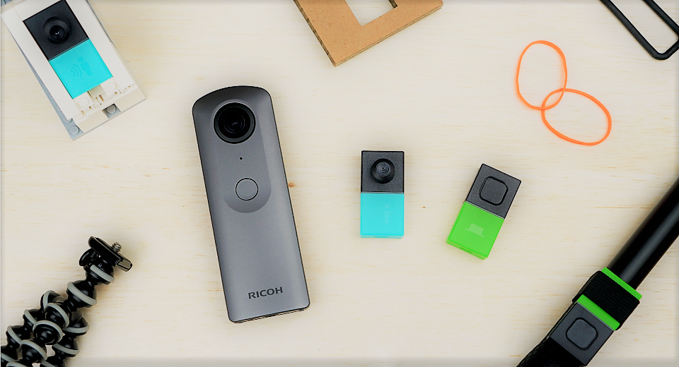
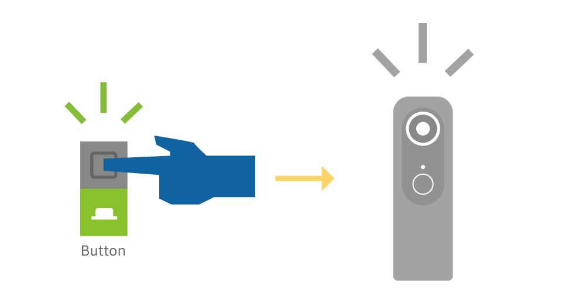
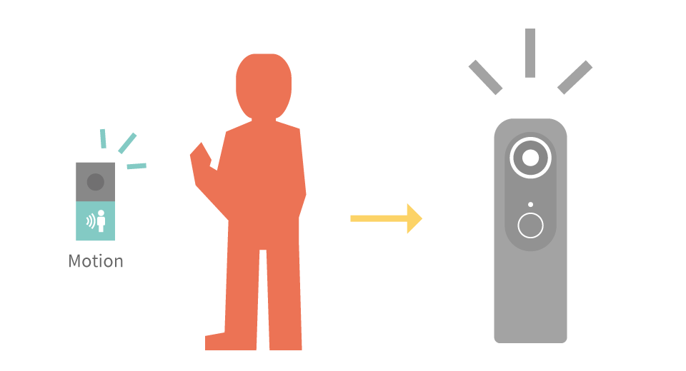
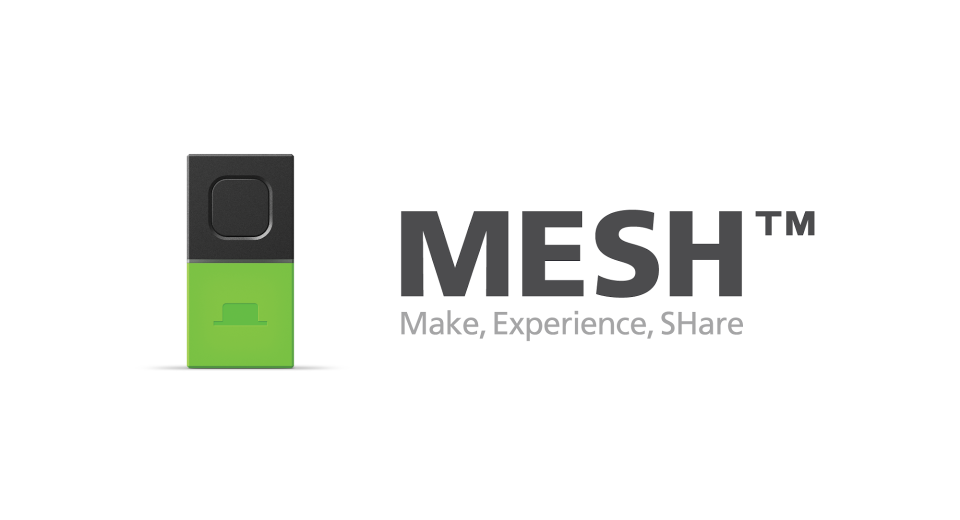

[English(US)](README.md) | 日本語

# MESH Plug-in for RICOH THETA
Sony Corporation  
[プライバシーポリシー](../../README.ja.md#%E3%83%97%E3%83%A9%E3%82%A4%E3%83%90%E3%82%B7%E3%83%BC%E3%83%9D%E3%83%AA%E3%82%B7%E3%83%BC) | [利用規約](../../README.ja.md#%E5%88%A9%E7%94%A8%E8%A6%8F%E7%B4%84)

 
 <table>
  <tr>
   <td></td>
   <td></td>
   <td></td>
   <td></td>
  </tr>
 </table>

***

## 説明
MESHは、無線でつながるセンサー等のブロックをつなげて、IoTの仕組みを手軽につくることができる製品です。「MESH Plug-in for RICOH THETA」では、RICOH THETAの撮影コントロールを、スマートフォンのMESHアプリを使わずにMESHブロックとRICOH THETAのみで直接行えるプラグインです。リモートシャッターやセンサーを使った自動撮影にチャレンジしてみましょう。

## 情報
  * 更新日：2018/7/20
  * バージョン：1.0.0
  * 要件：
    * RICOH THETA V （ファームウェア バージョン 2.30.1）
  * サポート：[Partner Plugins](https://support.meshprj.com/hc/en-us)
  * 年齢制限：なし

* プラグインをインストールするにはパソコン用基本アプリ [RICOH THETA](https://theta360.com/ja/about/application/pc.html#app-detail-01) が必要です
