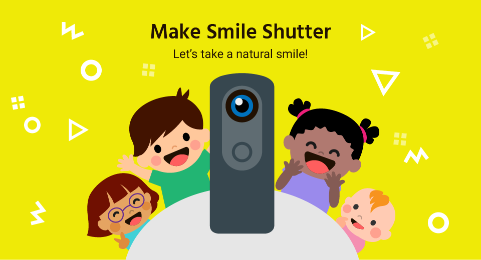
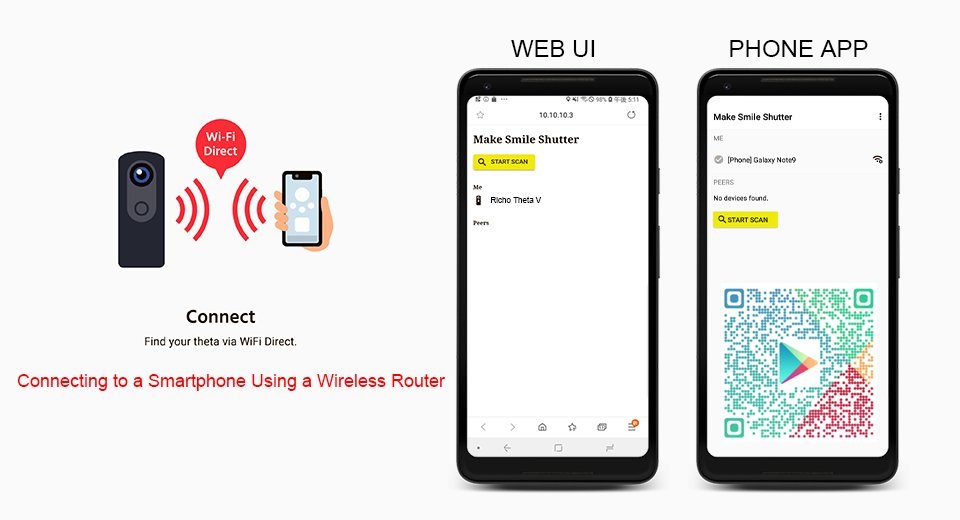
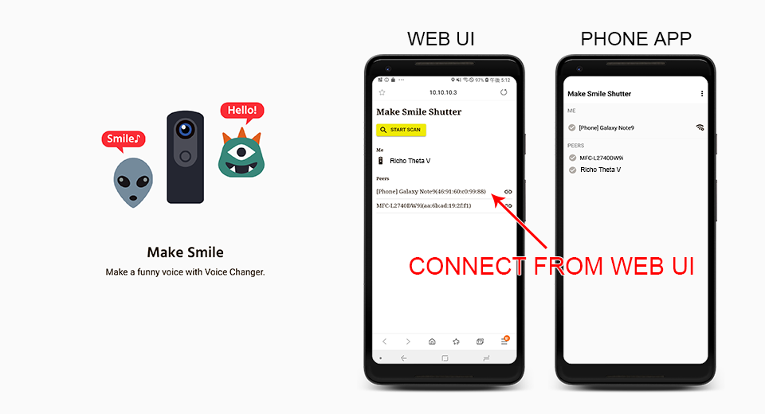
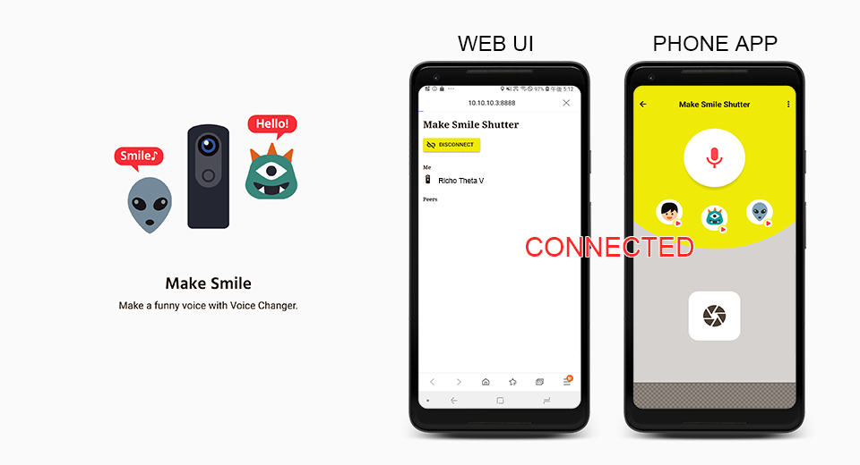
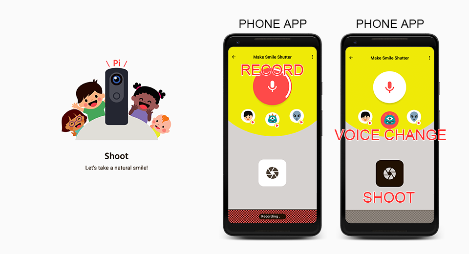

[English(US)](README.md) | 日本語

# Make Smile Shutter
Taosoftware  
[利用規約](https://github.com/baobab2013/makesmileshutter#terms)

 
 <table>
  <tr>
   <td></td>
   <td></td>
   <td></td>
   <td></td>
  </tr>
 </table>

***

## 説明
Make Smile Shutterのボイスチェンジャーを使うことで、RICOH THETAを注目している子どもたちの素敵な笑顔を撮ることができます。  
  
Make Smile Shutter はRICOH THETA向けプラグイン開発者コンテスト「RICOH THETA Dream and Build Contest」応募作品です。  
https://www.hackster.io/contests/theta/hardware_applications/10590  
  
## 情報
  * 更新日：2019/7/22
  * バージョン：1.0.3
  * 要件：
    * RICOH THETA V （ファームウェア バージョン 2.50.1）
  * サポート：[Partner Plugins](https://github.com/baobab2013/makesmileshutter)
  * 年齢制限：なし

* プラグインをインストールするにはパソコン用基本アプリ [RICOH THETA](https://theta360.com/ja/about/application/pc.html#app-detail-01) が必要です
