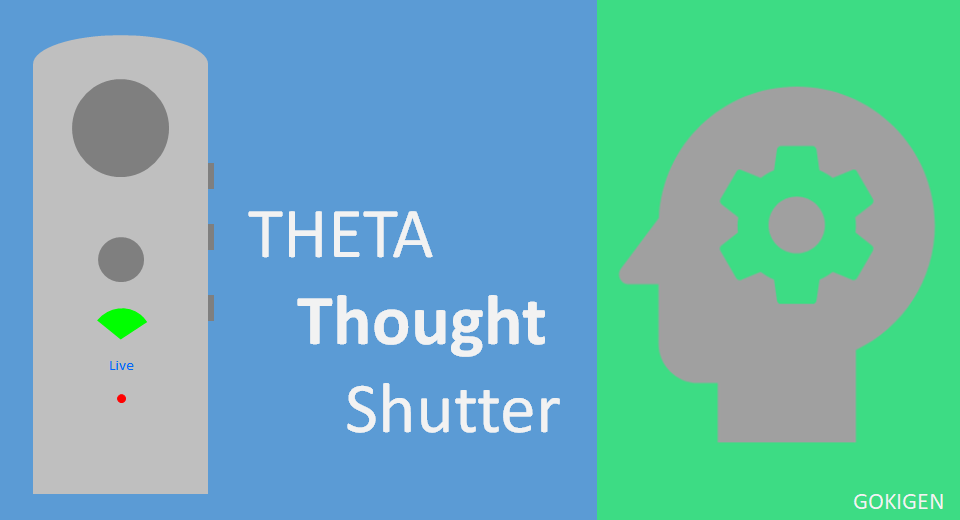
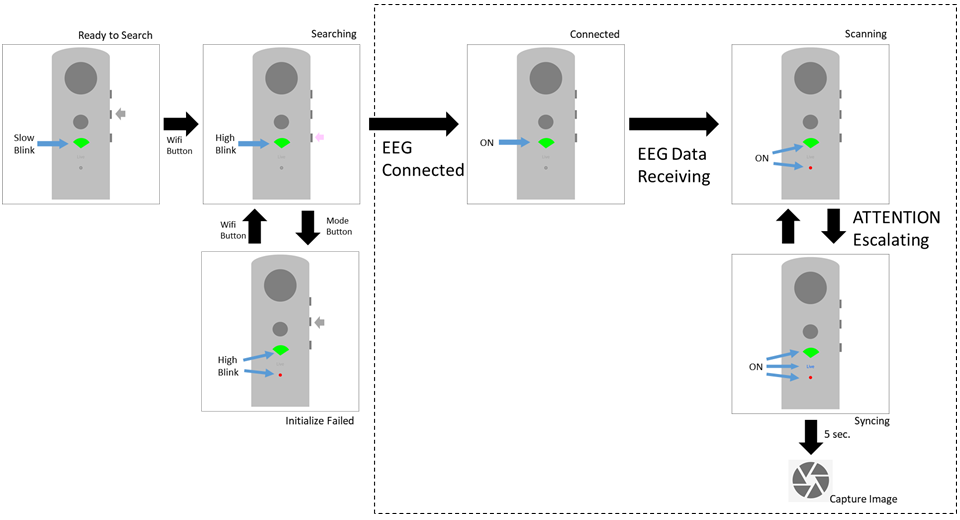

English(US) | [日本語](README.ja.md)

# Theta "Thought" Shutter
MRSa  
[Terms of Use](https://osdn.net/projects/gokigen/scm/git/ThetaThoughtShutter/blobs/master/LICENSE.txt)

 

 <table>
  <tr>
   <td></td>
   <td></td>
   <td></td>
   <td></td>
  </tr>
 </table>

***

## Description
Theta "Thought" Shutter : The THETA Plugin for Capture image using the NeuroSky Mindwave Mobile2.  
  
The MindWave Mobile2 safely measures and outputs the EEG power spectrums (alpha waves, beta waves, etc), NeuroSky eSense meters (attention and meditation).  
  
This plugin can capture a image If the sensor detects a high-level attention.  
  
It can capture a image without no operation but just only "thinking" .  
  
## Information
  * Updated：2021/3/11
  * Version：10.00.0001
  * Requires：
    * RICOH THETA Z1 (Firmware version 1.60.1)
    * RICOH THETA V (Firmware version 3.50.1)
  * Support：[Partner Plugins](https://bit.ly/38udttW)
  * Age Restriction：No

* The [RICOH THETA](https://theta360.com/ja/about/application/pc.html#app-detail-01) basic app for computer is required to install plugins
