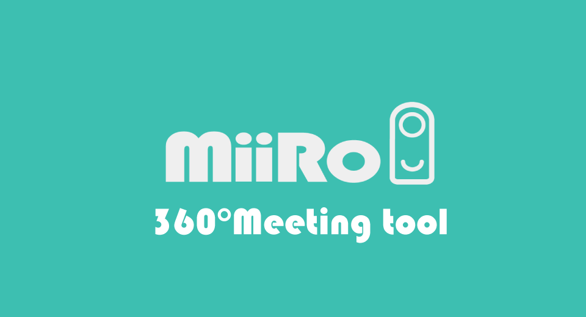
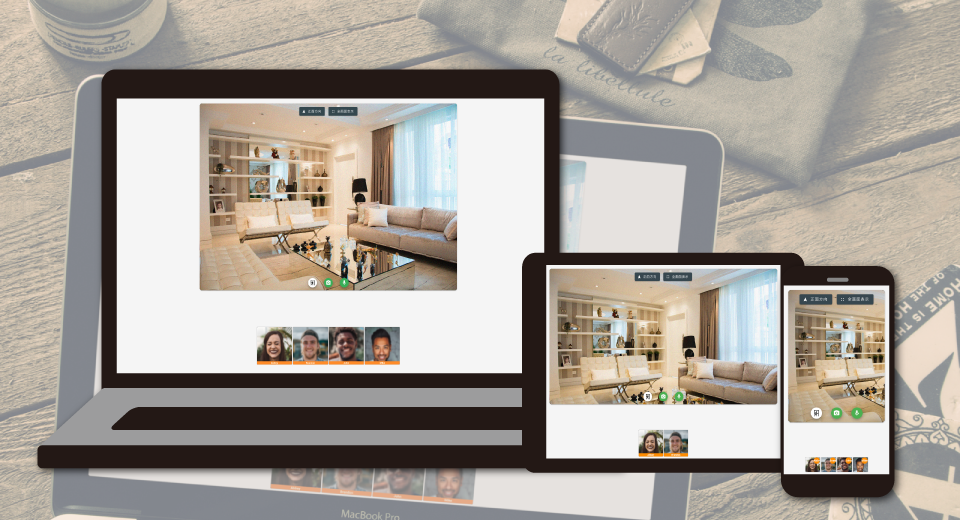

English(US) | [日本語](README.ja.md)

# MiiRo
EDGECASE, Inc.  
[Privacy Policy](../../README.md#privacy-policy) | [Terms of Services](../../README.md#terms-of-services)

 

 <table>
  <tr>
   <td></td>
   <td></td>
   <td></td>
   <td></td>
  </tr>
 </table>

***

## Description
MiiRo is 360° Remote Meeting Tool.  
This plug-in enables 360° video streaming to MiiRo.  
  
## What's New
Fixed a minor bug.

## Information
  * Updated：2022/9/28
  * Version：1.0.1
  * Requires：
    * RICOH THETA Z1 (Firmware version 2.10.1)
    * RICOH THETA V (Firmware version 3.80.2)
  * Support：[Partner Plugins](https://www.edgecase.jp/products/miiro/plug-in_en)
  * Age Restriction：No

* The [RICOH THETA](https://theta360.com/ja/about/application/pc.html#app-detail-01) basic app for computer is required to install plugins
