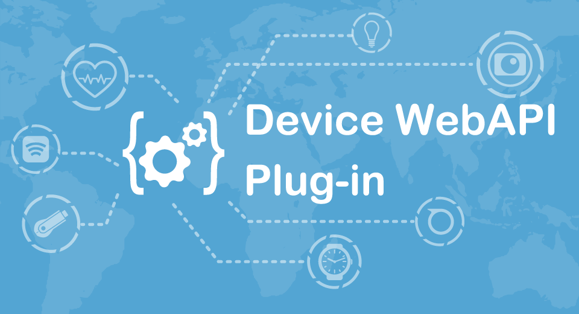

English(US) | [日本語](README.ja.md)

# Device WebAPI Plug-in

GClue, Inc.  
[Terms of Use](http://www.gclue.io/privacy/en/privacy_theta.html)

<table><tr><td></td><td></td><td></td><td></td></tr></table>

## Description

Device Web API Plug-in works as a virtual server on THETA V and provides the following web API for operating the device.  
  
- Take a photography
- Take a video
- Live preview
- Managed Storage
  
Device WebAPI Plug-in is an experimental application developed based on Device Connect Web API of open source project.  
  
EXPERIMENTAL:Since this application launches a web server on THETA, information may be exposed unintentionally when it is used in an insecure network. Please be careful when using.  

## What's New

Supported THETA Z1

## Information

- Updated: 2019/10/28
- Version: 1.1.0
- Requires:
  - RICOH THETA Z1 (v1.11.1)
  - RICOH THETA V (v3.04.1)
- Support: [Partner Plugins](https://www.gclue.io/theta/en/)
- Age Restriction: No
