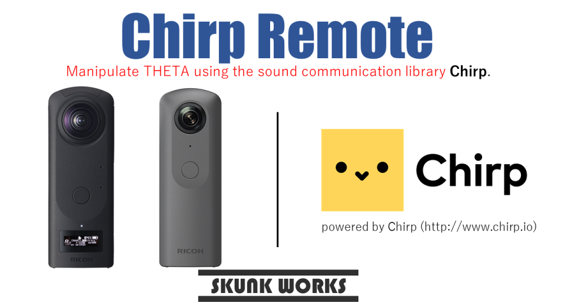
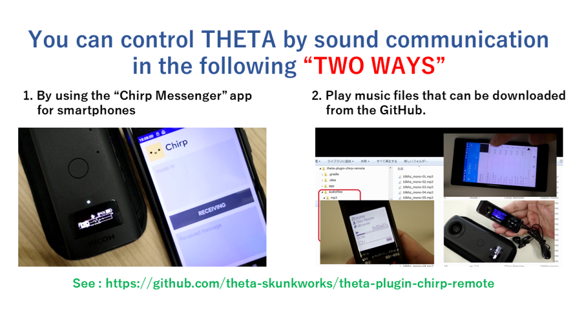
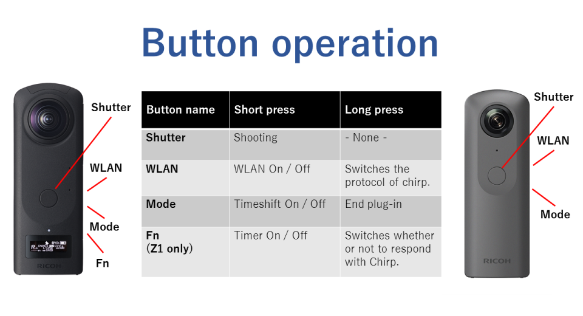
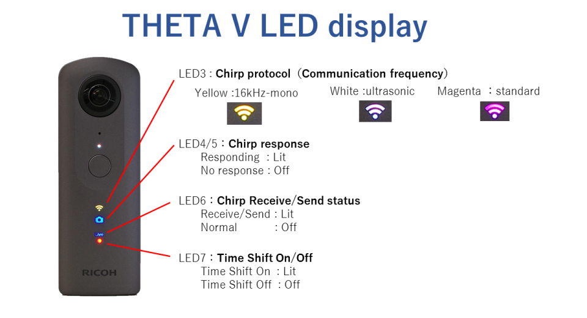
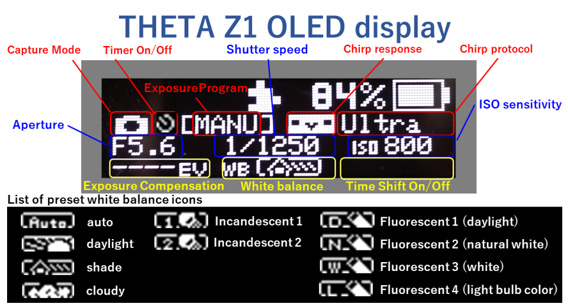

English(US) | [日本語](README.ja.md)

# Chirp Remote

SKUNK WORKS  
[Terms of Use](https://www.ricoh360.com/terms/plugins/)

<table><tr><td></td><td></td><td></td><td></td></tr></table>

## Description

This THETA plug-in is powered by Chirp(http://www.chirp.io).  
Using this THETA plug-in, you can remotely control THETA by sound communication using the Asio Ltd. Chirp library.  
  
Currently, Asio Ltd. is under the umbrella of SONOS, and the Chirp library and smartphone application are not open to the public.  
However, this plug-in can be used in the following ways.  
  
1. Play music files in mp3 or wav format that can be downloaded from the "audiofiles" folder in GitHub repository on various audio players.  
  
GitHub:https://github.com/theta-skunkworks/theta-plugin-chirp-remote/tree/master/audiofiles

## What's New

Clarified that this plug-in can be used by playing music files published on GitHub.

## Information

- Updated: 2021/7/19
- Version: 1.0.1
- Requires:
  - RICOH THETA Z1 (v1.11.1, v1.20.1, v1.31.1, v1.40.1, v1.50.1, v1.60.1, v1.80.1, v2.00.1)
  - RICOH THETA V (v3.06.1, v3.10.1, v3.21.1, v3.30.1, v3.40.1, v3.50.1, v3.60.1, v3.70.1)
- Support: [Partner Plugins](https://github.com/theta-skunkworks/theta-plugin-chirp-remote/blob/master/README.md)
- Age Restriction: No
