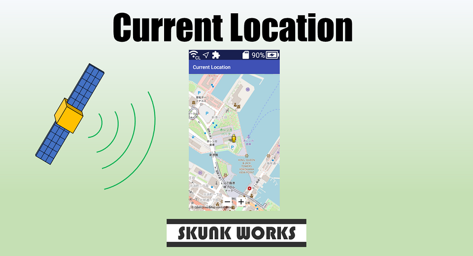

English(US) | [日本語](README.ja.md)

# Current Location

SKUNK WORKS  
[Terms of Use](https://www.ricoh360.com/terms/plugins/)

<table><tr><td></td><td></td><td></td><td></td></tr></table>

## Description

This plugin displays your location in map data provided by OpenStreetMap (https://www.openstreetmap.org/copyright/).  
  
You can display a map of any point by dragging the screen.  
You can adjust the zoom level by operating the "+" and "-" buttons displayed by tapping the screen.  
  
If the current location is unfollowed by the above screen operation, you can return to the state of following the current location again by pressing the shutter button.  
However, the display position does not change in places where radio waves from GNSS (Global Navigation Satellite System) cannot be received, such as indoors. Please be careful.  
  
When used offline, you can use a map of the range and zoom level that you have seen while online in the past.
If the map is not displayed, please use it online.  
(It is recommended to use it online at the first startup)  
  
[Information for developers]  
This plugin can also be called and used from other plugins.  
Please refer to the following URL for usage.  
https://github.com/theta-skunkworks/theta-plugin-current-location#6-calls-from-other-plugins-with-implicit-intents  

## What's New

Fixed a bug in implicit intent parameter parsing.

## Information

- Updated: 2022/10/20
- Version: 1.0.2
- Requires:
  - RICOH THETA X (v1.30.0)
- Support: [Partner Plugins](https://github.com/theta-skunkworks/theta-plugin-current-location)
- Age Restriction: No
