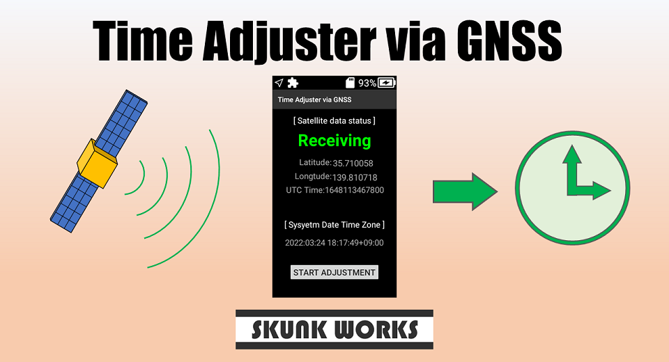

English(US) | [日本語](README.ja.md)

# Time Adjuster via GNSS
SKUNK WORKS  
[Terms of Use](https://theta360.com/en/legal/terms_of_use_plugins/)

 

 <table>
  <tr>
   <td></td>
   <td></td>
   <td></td>
   <td></td>
  </tr>
 </table>

***

## Description
When you press the "START ADJUSTMENT" button in a place where you can receive radio waves emitted from the Global Navigation Satellite System(GNSS), the time of the camera will be adjusted.  
  
If you press the "START ADJUSTMENT" button in a place where radio waves cannot be received, the time will be set when the radio waves are received.  
  
If you continue to be unable to receive radio waves, you can cancel the reserved adjustment status by pressing the "STOP ADJUSTMENT" button.  
  

[NOTE]  

- Time adjustment using positioning satellites can be performed only when this plug-in is running. It doesn't work in the background.

- To set the time with this plug-in, check that the following two settings are valid from the menu UI of the camera.  
Check Point 1 : "position information addition function" is On.  
Check Point 2 : "Date / time setting"-> "Auto" is On.  

## Information
  * Updated：2022/4/26
  * Version：1.0.0
  * Requires：
    * RICOH THETA X (Firmware version 1.00.2,1.10.1)
  * Support：[Partner Plugins](https://github.com/theta-skunkworks/theta-plugin-time-adjuster-via-gnss)
  * Age Restriction：No

* The [RICOH THETA](https://theta360.com/ja/about/application/pc.html#app-detail-01) basic app for computer is required to install plugins
