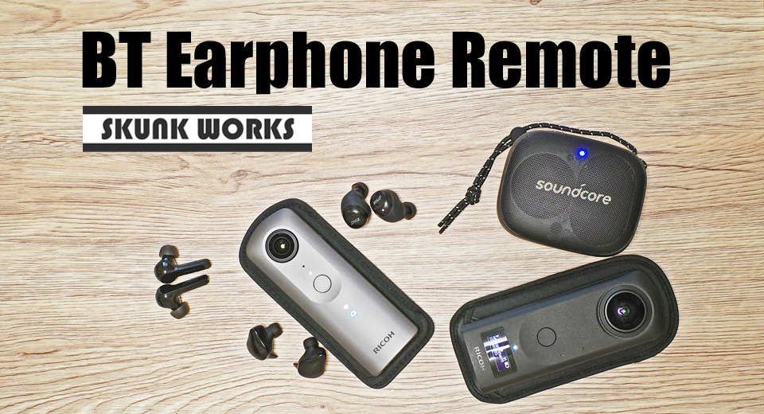
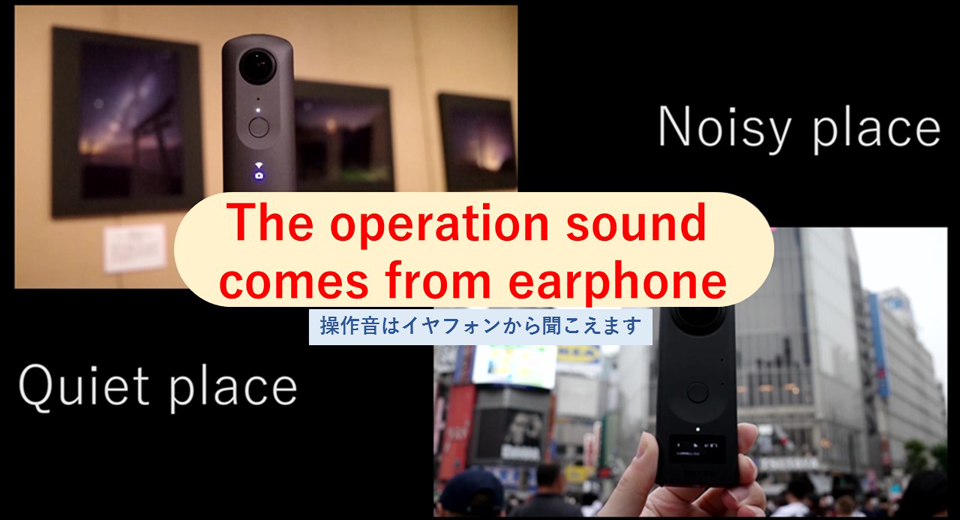
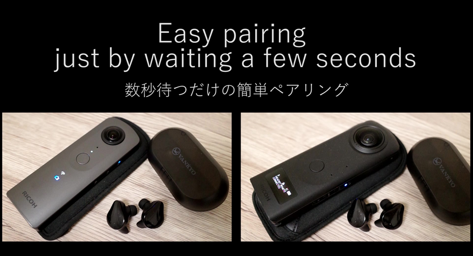
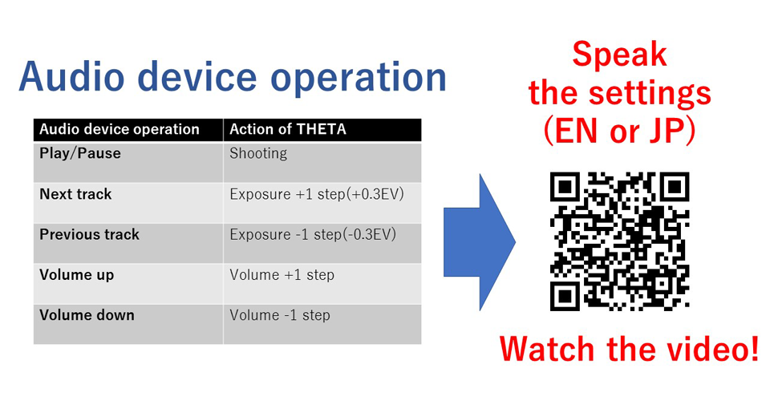
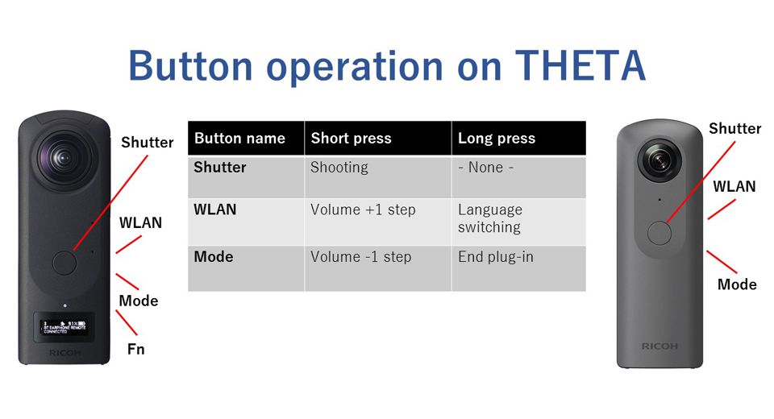

English(US) | [日本語](README.ja.md)

# BT Earphone Remote
SKUNK WORKS  
[Privacy Policy](../../README.md#privacy-policy) | [Terms of Services](../../README.md#terms-of-services)

 

 <table>
  <tr>
   <td></td>
   <td></td>
   <td></td>
   <td></td>
  </tr>
 </table>

***

## Description
With this THETA plug-in, you can remotely control THETA from Bluetooth audio devices such as earphones.  
  
The pairing procedure is simple.  
All you have to do is make your Bluetooth audio device pairable and launch this THETA plug-in.  
  
By manipulating your audio device, you can:  
-Shoot by operating "Play / Pause".  
-Exposure compensation can be increased / decreased by operating "Next track / Previous track".  
-Increase / decrease the volume by operating "Volume up / down".  
  
The results of exposure compensation and volume control will be announced by voice (English or Japanese).  
You can switch the speaking language by long press the WLAN button of THETA.  
  
You can also adjust the volume by short press the WLAN button or Mode button.  
  
Restrictions:  
Launching this plug-in switches the capture mode to "still image capture mode".  
Even after the plug-in ends, the capture mode remains in the "still image capture mode".  
  
  
## Information
  * Updated：2020/11/20
  * Version：1.2.0
  * Requires：
    * RICOH THETA Z1 (Firmware version 1.50.1)
    * RICOH THETA V (Firmware version 3.40.1)
  * Support：[Partner Plugins](https://github.com/theta-skunkworks/theta-plugin-bluetooth-headset-sample)
  * Age Restriction：No

* The [RICOH THETA](https://theta360.com/ja/about/application/pc.html#app-detail-01) basic app for computer is required to install plugins
