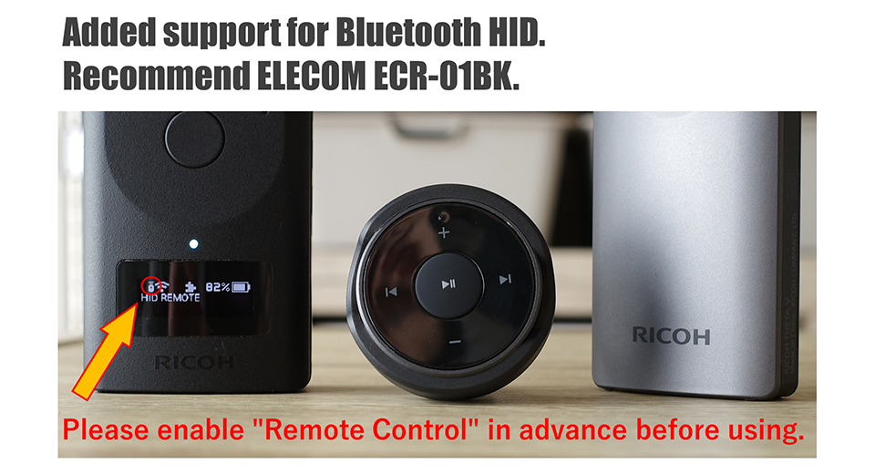
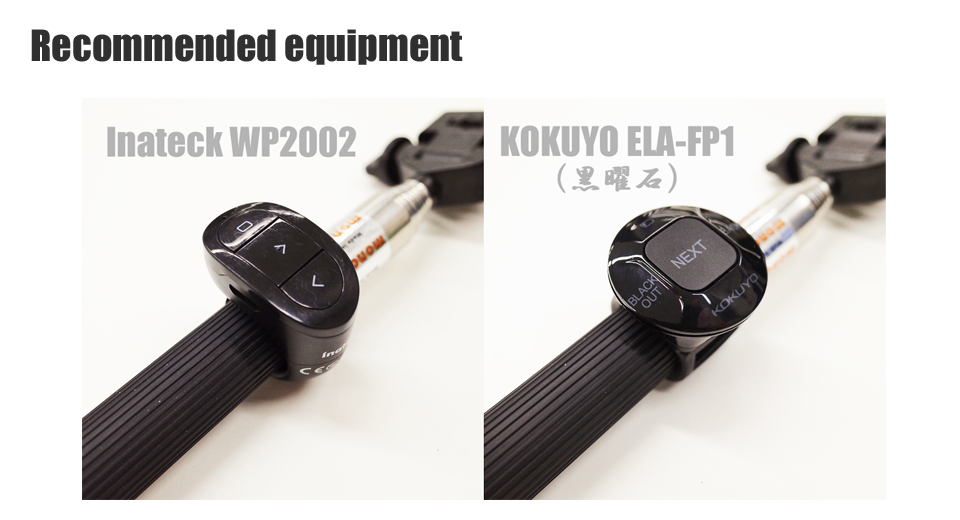
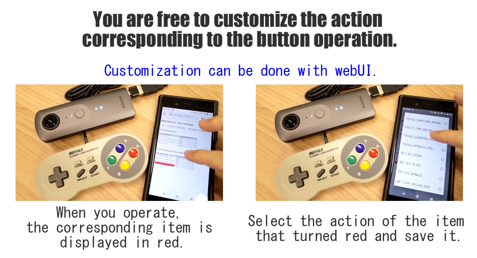

[English(US)](README.md) | 日本語

# HID Remote
SKUNK WORKS  
[利用規約](https://theta360.com/en/legal/terms_of_use_plugins/)

 
 <table>
  <tr>
   <td></td>
   <td></td>
   <td></td>
   <td></td>
  </tr>
 </table>

***

## 説明
このプラグインを使うと、接続したHID(Human Interface Device)を用いて、THETAをリモートコントロールできるようになります。  
  
HIDにはキーボード、マウス、フィンガープレゼンター、ゲームコントローラ、VRマウスなど様々なものがあります。  
有線と無線どちらのタイプのHIDでも利用できます。  
  
V1.1.0 からBluetoothのHID機器にも対応しているので幅広い機器でご利用いただけます。  
FWのバージョンをアップし、本プラグインを起動する前に、プリインストール済のRemote Controlプラグインでリモートコントロール機能を有効にしておくと、BluetoothのHID機器もご利用いただけます。  
https://www.thetalab.ricoh/plugin/remote-control/  
  
全てのHIDを試せているわけではありません。今のところ、主にWindowsやAndroidに対応しているものが利用できています。  
  

割り当て可能な動作は、現時点で27通り（「無処理」という動作を含めると28通り）です。  
  
リモート操作した結果を、THETAが発話して伝える動作もあります。  
英語と日本語に対応しており、初期値ではModeボタンに言語切り替えが割り当ててあります。  
  
詳しくはこちらをご参照ください。  
https://qiita.com/KA-2/items/e847c780cc0fee187f89  
https://github.com/theta-skunkworks/theta-plugin-usb-hid-sample  
https://youtu.be/to9nDoRqm3Y  
  
このプラグインを使用時は、THETA本体のボタンも仕組みはHIDと同じです。  
このプラグインを使ってTHETA本体のボタンの役割も変更することができます。  
  
このプラグインを使ってあなたのTHETAをより良い操作性にカスタマイズしてみてください。  
  
## 新機能
バージョンアップ内容は以下の通りです。  
  
1.二ヵ国語対応と音質向上:  
旧バージョンでは日本語のみに対応していましたが、日本語と英語の二ヵ国語に対応しました。  
また、合成音声の音質が向上しました。  
旧バージョンから引き続きこのプラグインを利用している場合、「TGGLE_LANGUAGE」という項目を何らかのボタンに割り当て、お好みの言語設定に切り替えた後、これまでのボタン割り当てに戻してご利用ください。  

2.THETA Z1利用時のOLED表示変更:  
プラグイン動作中にプラグイン名称を表示するようにしました。  

3.Bluetooth HIDへの対応  
プラグインのバージョンが古いままでも、THETAのFWのバージョンをアップすると利用可能でしたが、改めて利用方法を記載しました。  
  
## 情報
  * 更新日：2021/6/3
  * バージョン：1.1.0
  * 要件：
    * RICOH THETA Z1 （ファームウェア バージョン 1.60.1,1.80.1）
    * RICOH THETA V （ファームウェア バージョン 3.60.1）
  * サポート：[Partner Plugins](https://github.com/theta-skunkworks/theta-plugin-usb-hid-sample)
  * 年齢制限：なし

* プラグインをインストールするにはパソコン用基本アプリ [RICOH THETA](https://theta360.com/ja/about/application/pc.html#app-detail-01) が必要です
