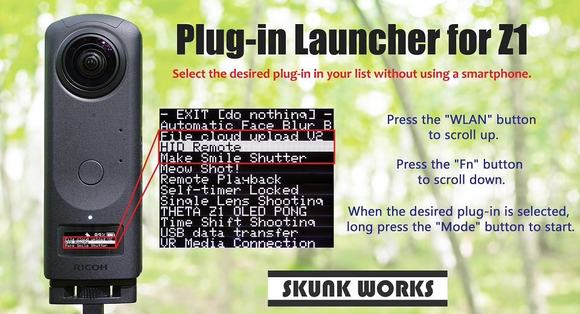
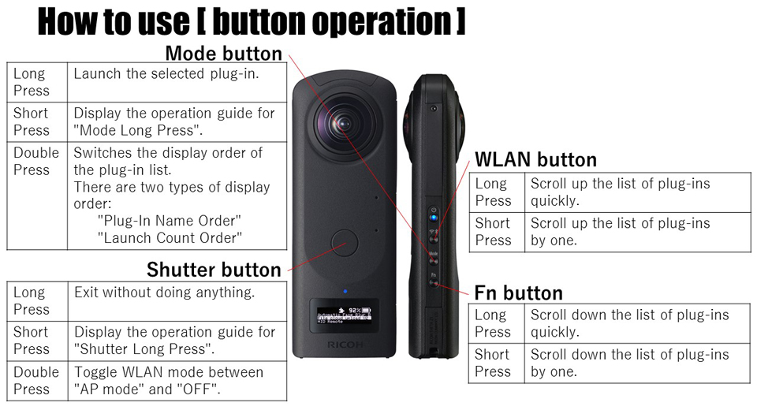

English(US) | [日本語](README.ja.md)

# Plug-in Launcher for Z1

SKUNK WORKS  
[Terms of Use](https://www.ricoh360.com/terms/plugins/)

<table><tr><td></td><td></td><td></td><td></td></tr></table>

## Description

With THETA alone, you can select the desired plug-in from all already installed plug-ins and start the plug-in.  
No need to connect your smartphone or computer with THETA before launching the plug-in!  
  
Button operation  
  
・Shutter Button  
Long Press :Exit without doing anything.  
Short Press :Display the operation guide for "Shutter Long Press".  
Double Press :Toggle WLAN mode between "AP mode" and "OFF".  
  
・Shutter Button  
Long Press :Scroll up the list of plug-ins quickly.  
Short Press :Scroll up the list of plug-ins by one.  
  
・Shutter Button  
Long Press :Launch the selected plug-in.  
Short Press :Display the operation guide for "Mode Long Press".  
Double Press :Switches the display order of the plug-in list.  
* There are two types of display order: "Plug-In Name Order" and "Lounch Count Order".  
* The initial value is "Plug-in name order".  
  
・Shutter Button  
Long Press :Scroll down the list of plug-ins quickly.  
Short Press :Scroll down the list of plug-ins by one.  
  
  
When WLAN mode is AP mode, you can do the following with webUI.  
(1) Switch the plug-in list display order.  
(2) Display all plug-in lists according to the currently set display order.  
  
Note:  
After launching another plug-in from this plug-in, only this plug-in is set in the standard plug-in start list.  

## Information

- Updated: 2019/10/17
- Version: 1.0.2
- Requires:
  - RICOH THETA Z1 (v1.11.1)
- Support: [Partner Plugins](https://github.com/theta-skunkworks/theta-plug-in-launcher)
- Age Restriction: No
