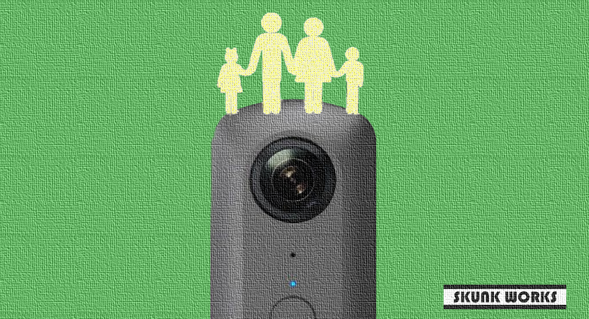
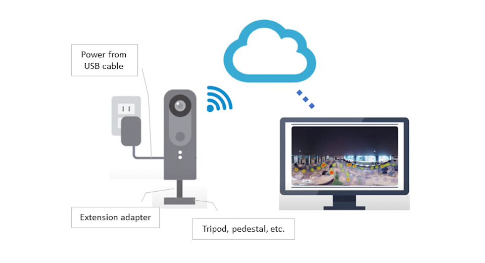
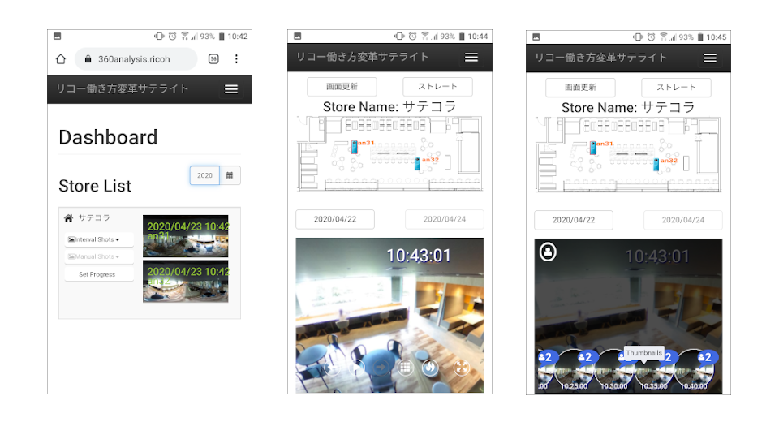
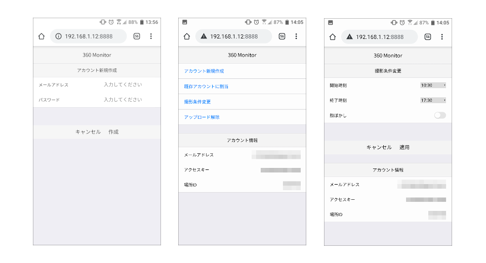

English(US) | [日本語](README.ja.md)

# 360 Monitor Free

SKUNK WORKS  
[Terms of Use](https://www.ricoh360.com/terms/plugins/)

<table><tr><td></td><td></td><td></td><td></td></tr></table>

## Description

With RICOH THETA V / RICOH THETA Z1, you can browse on-site situation!  
You can remotely browse the 360 degree images taken at intervals via the dedicated website.  
  
By installing the 360 Monitor plug-in, you can transform your THETA into a monitoring camera.  
With the simple system, you can record and view the children and pets at home, the family at a remote place, the office and the store during the self-restraint period.  
  
* THETA must be used in client mode.
  
Instructions  
  
1. Connect RICOH THETA in client mode.
   * See the following for further details on how to connect and adjust settings for the RICOH THETA in client mode.
      * Video: https://www.youtube.com/watch?v=tkqyBNOWWIY
      * Manual: https://theta360.com/en/support/manual/v/content/prepare/prepare_08.html
2. From the basic app for smartphones, select "Settings" > "Camera settings" and set "360 Monitor" in "Plug-in", then tap the icon displayed next to "Starting plug-in".
   * The browser is launched and the settings screen appears.
3. When creating a new account, enter the "email address" and "password" used on the dedicated website.
4. If necessary, change the shooting conditions to set "shooting time" and "blurring ON/OFF".
5. With the above, interval shooting and image upload to the dedicated website will start automatically.
6. Upon exiting the plug-in mode, the upload will end.
  
For more information, please refer to the following website.  
https://360analysis.ricoh/monitoring/en/  
(Operation Manual) https://360analysis.ricoh/monitoring/en/help/360Analysis_Monitoring_Manual.pdf  
  
  
Precautions  
  
1. Depending on the network conditions, you may not be able to upload images.
2. When used for a long time, the operation may stop due to heat generation.In that case, please reboot THETA and start the plug-in again.

## What's New

Support proxy settings

## Information

- Updated: 2020/7/15
- Version: 0.0.2
- Requires:
  - RICOH THETA Z1 (v1.40.1)
  - RICOH THETA V (v3.30.1)
- Support: [Partner Plugins](https://360analysis.ricoh/monitoring/en/)
- Age Restriction: No
