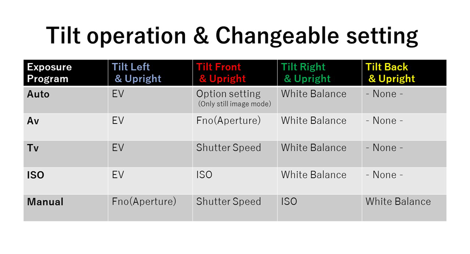
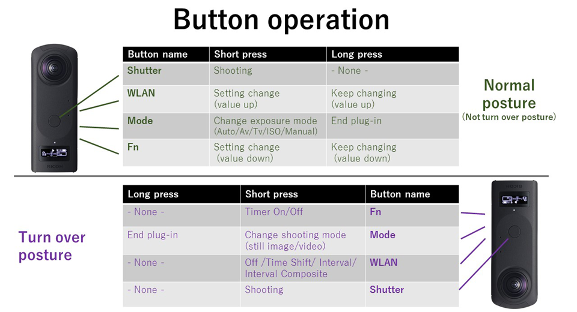
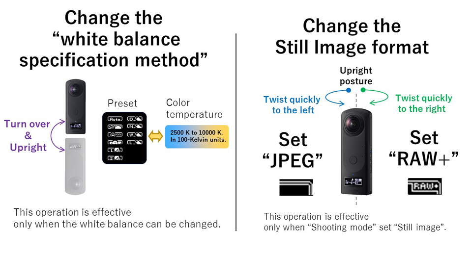
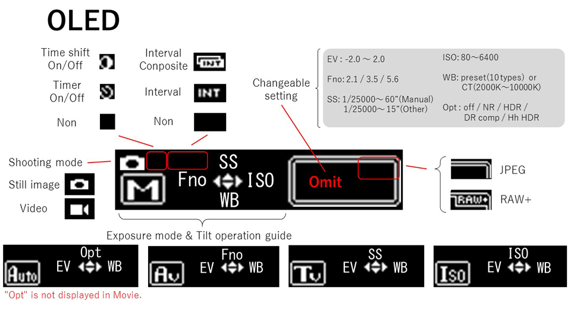

English(US) | [日本語](README.ja.md)

# Change via Tilt
SKUNK WORKS  
[Terms of Use](https://theta360.com/en/legal/terms_of_use_plugins/)

 

 <table>
  <tr>
   <td></td>
   <td></td>
   <td></td>
   <td></td>
  </tr>
 </table>

***

## Description
With this THETA plug-in, you can change the shooting settings by combining THETA's position (tilt) and button operations.  
Most shooting settings can be done without a smartphone.  
  
The settings that can be operated with this plug-in are as follows.  
  
- Change shooting mode (still image/video)
- Change the exposure mode (Auto/Av/Tv/Iso/Manual)
- Change shooting settings for each exposure mode  
(Aperture, shutter speed, ISO sensitivity, white balance, Option setting in still image auto mode [NR/DR Comp/HDR/ Hh HDR]
- Change the white balance specification method (preset/color temperature)
- Change file format (JPEG / RAW +) when shooting still images
- Change self-timer on/off
- Change continuous shooting mode (Off/Time Shift/Interval/Interval Composite)
  
When you close the plug-in, the setting change made with the plug-in is saved and will be adopted when the plug-in is restarted.  
  
This plug-in is compatible with remote controllers (HID devices that send out the "Vol +" key code).  
  
Also see the video below.  
https://www.youtube.com/watch?v=5kFv-7Cc3h8  
  
  
## Information
  * Updated：2020/12/23
  * Version：1.0.0
  * Requires：
    * RICOH THETA Z1 (Firmware version 1.60.1)
  * Support：[Partner Plugins](https://github.com/theta-skunkworks/theta-plugin-tilt-ui/blob/main/README.md)
  * Age Restriction：No

* The [RICOH THETA](https://theta360.com/ja/about/application/pc.html#app-detail-01) basic app for computer is required to install plugins
