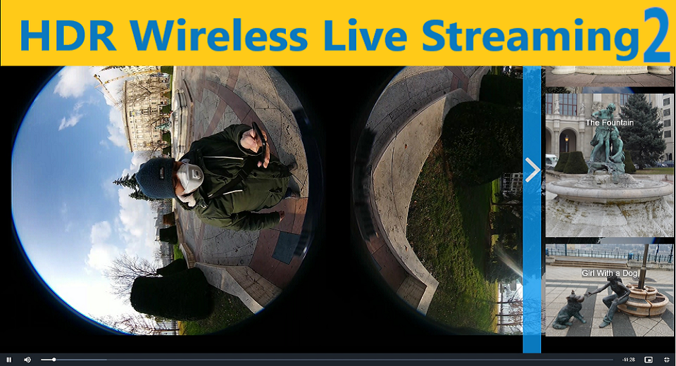

English(US) | [日本語](README.ja.md)

# HDR Wireless Live Streaming

Web and Build Solutions  
[Terms of Use](https://www.ricoh360.com/terms/plugins/)

<table><tr><td></td><td></td><td></td><td></td></tr></table>

## Description

With this plug-in, you can do high quality live streaming wirelessly to any server or social media that supports 360 (like YouTube), without any additional equipment needed. It provides much better quality compared to original wireless plugin and setup can be done easily via flow.tours website. You need to make sure that Z1 is connected to a WiFi router with a fast upload speed internet.

## What's New

Additional video modes, live stream stabilization: Worldlock, increased stability and longer streaming operation.

## Information

- Updated: 2022/9/28
- Version: 2.0.0
- Requires:
  - RICOH THETA Z1 (v1.80.1, v2.00.1, v2.10.3)
- Support: [Partner Plugins](https://www.flow.tours/en/ricoh-theta-users)
- Age Restriction: No
